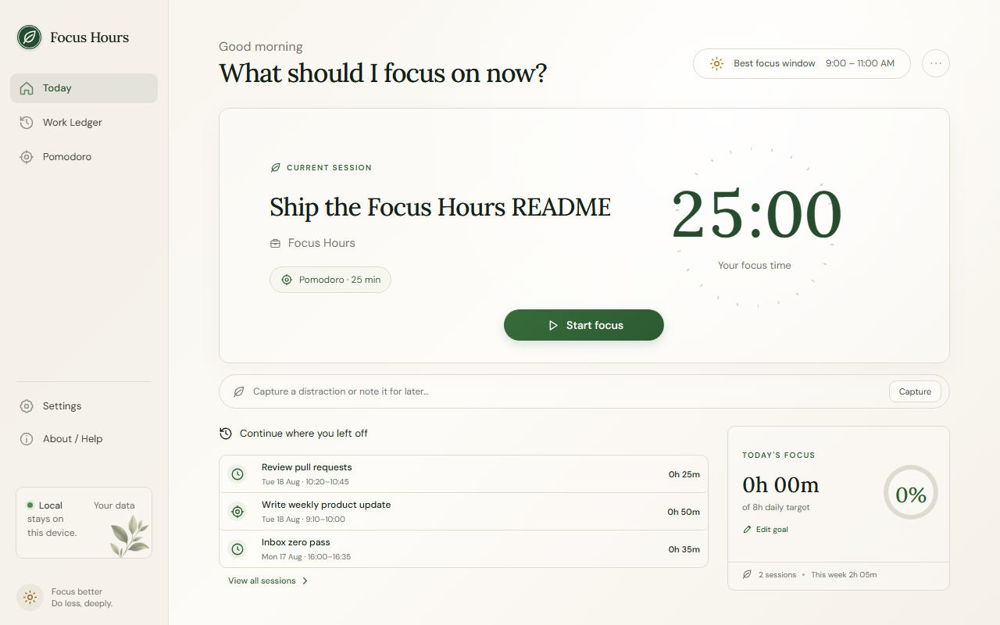
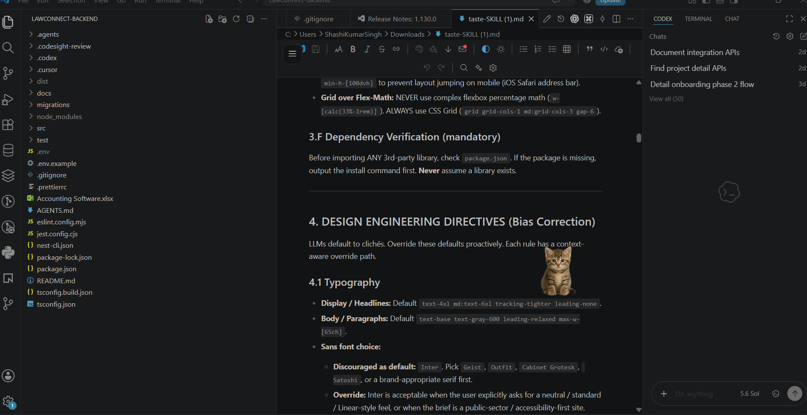
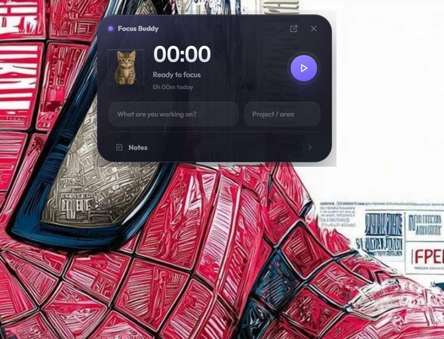
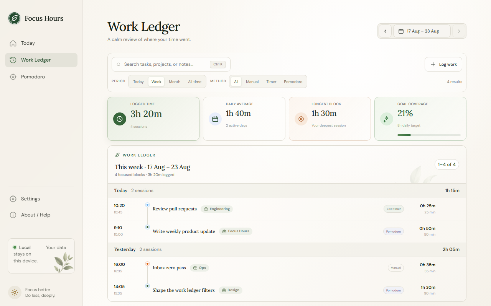
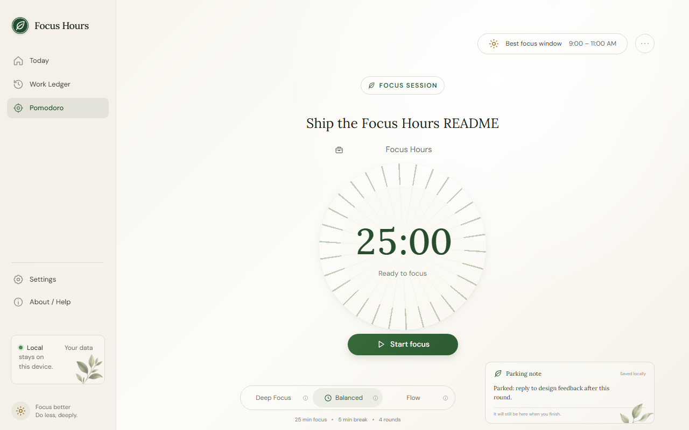
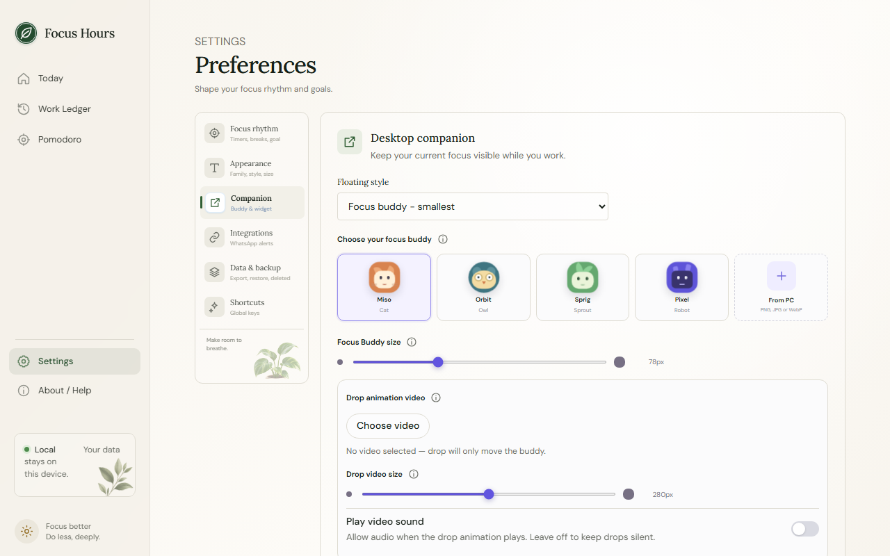

# Focus Hours

A small Windows app for staying with one task at a time. Start a timer or a Pomodoro, glance at a floating **Focus Buddy** on your desktop, and keep a private log of where the hours went. Nothing leaves your computer — no account, no cloud.

## Demo

A short walkthrough of Today, the work ledger, Pomodoro, and Focus Buddy.


[Watch with voiceover (MP4)](docs/demo.mp4)

## Screenshots

| Today | Focus Buddy |
|:---:|:---:|
|  |  |

| Expanded buddy | Work ledger |
|:---:|:---:|
|  |  |

| Pomodoro | Companion settings |
|:---:|:---:|
|  |  |

Name what you’re working on, start a session, pause from the dashboard or the buddy, and look back over the week in the work ledger. The companion can stay a tiny kitty on the desktop, or open into a panel for the timer, task, and notes.

## Setup

You need **Windows 10 or 11** and **[Node.js](https://nodejs.org/)** 18 or newer (LTS is fine). npm comes with Node.js.

```powershell
git clone https://github.com/shashikrsingh786/focus-hours-desktop.git
cd focus-hours-desktop
npm install
npm start
```

That opens the Focus Hours window. If the buddy is enabled in Settings, it floats on top of your other apps.

You can also double-click `Start Focus Hours.cmd` on this machine.

Optional: `npm run dist` builds a Windows installer and a portable app in `dist/`.

Sessions, notes, and buddy pictures stay on your PC:

```text
%APPDATA%\focus-hours\focus-hours-data.json
```

While the app is running: **Ctrl + Alt + Space** starts or stops the timer, **Ctrl + Alt + P** starts a Pomodoro, **Ctrl + Alt + M** shows or hides the buddy.

## Made with

The app, screenshots, and demo video were built with **Grok 4.6** in Cursor. The demo voiceover was generated locally with **[Piper](https://github.com/OHF-Voice/piper1-gpl)**.

## License

MIT
